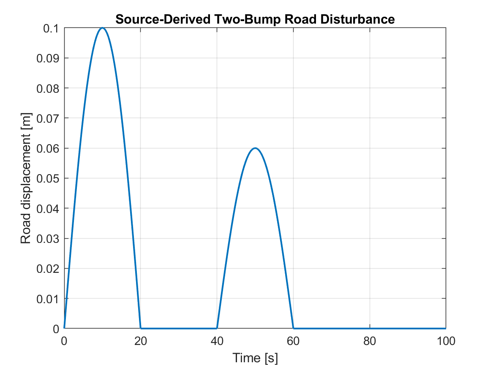
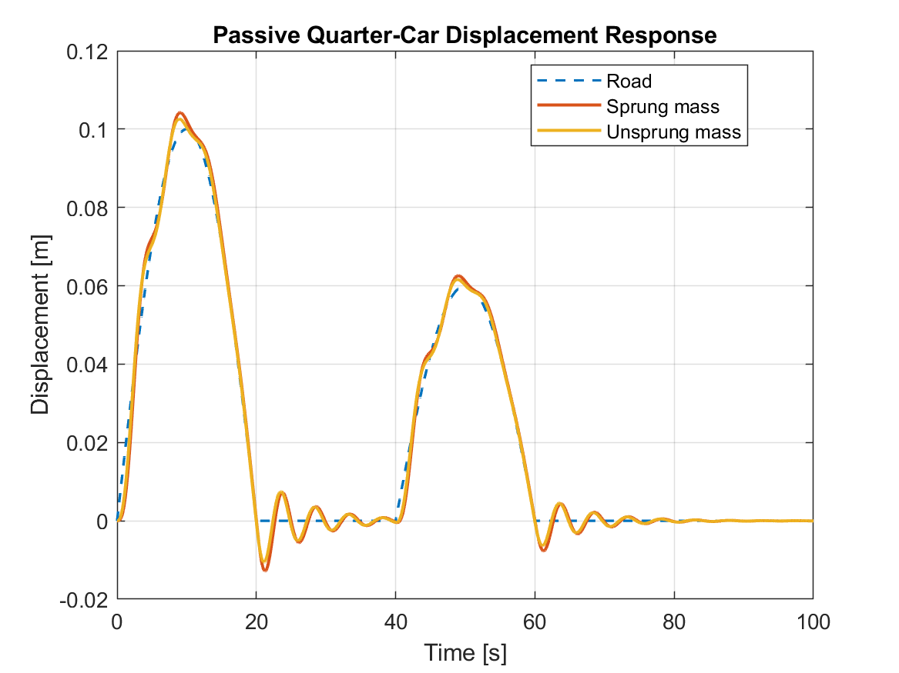
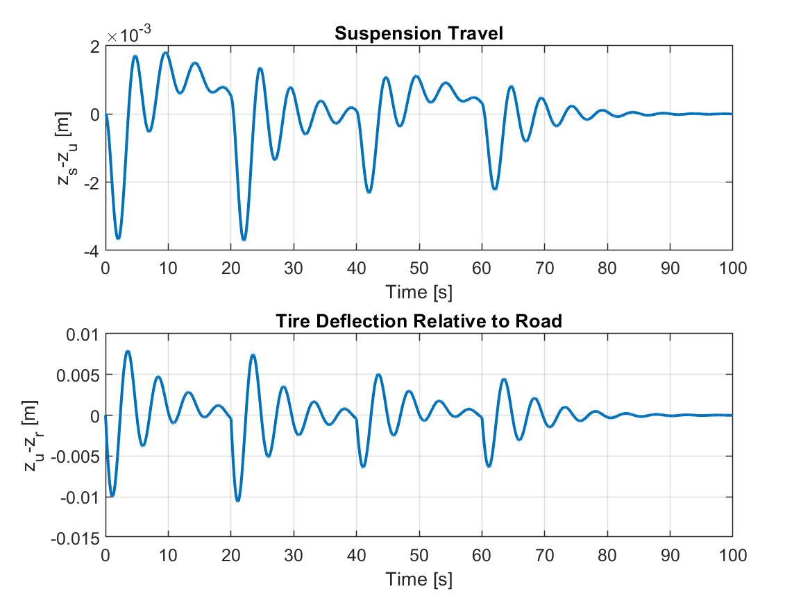
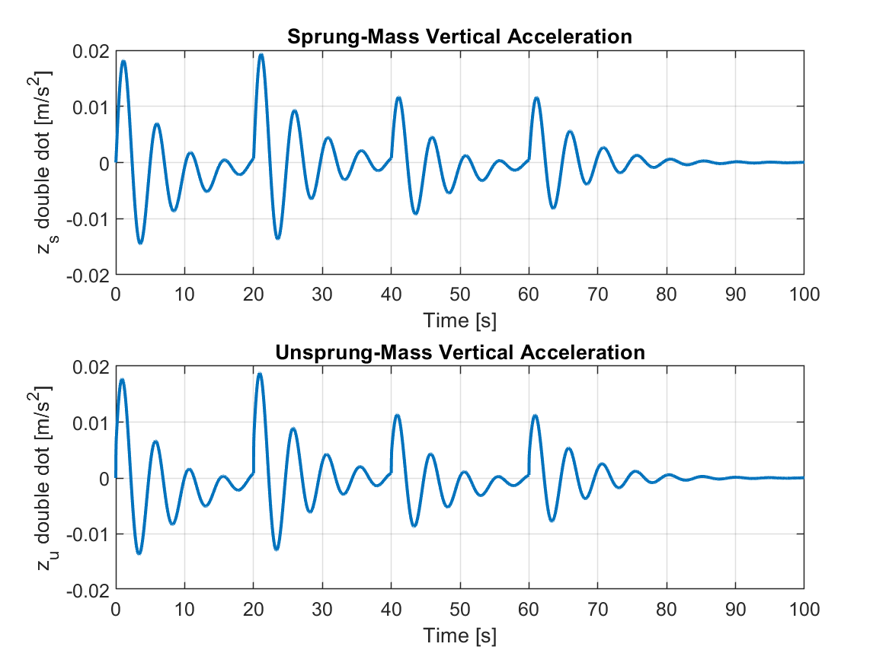
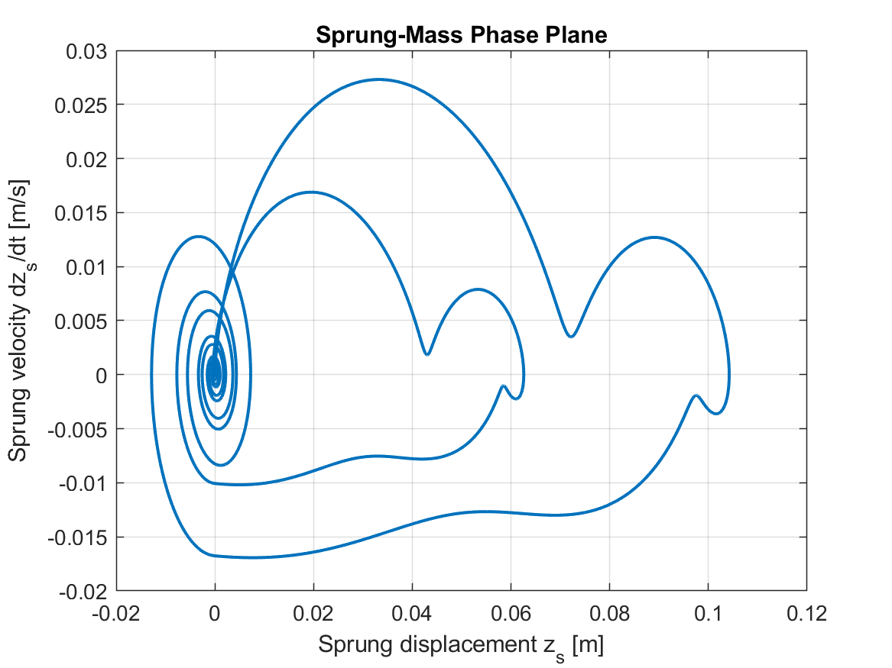
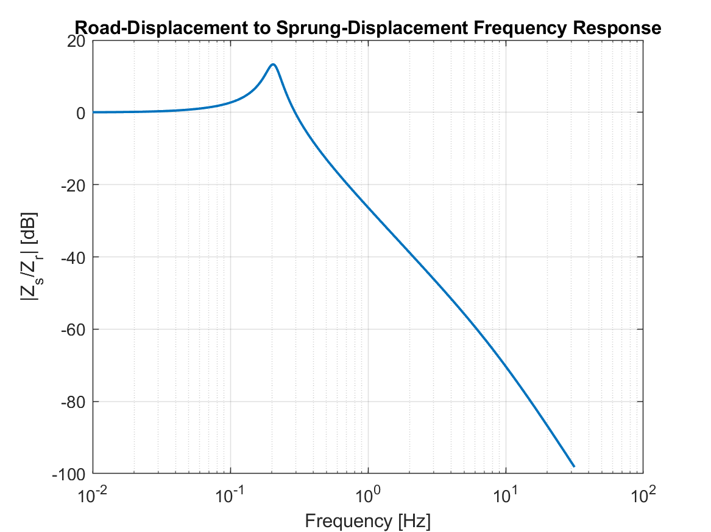
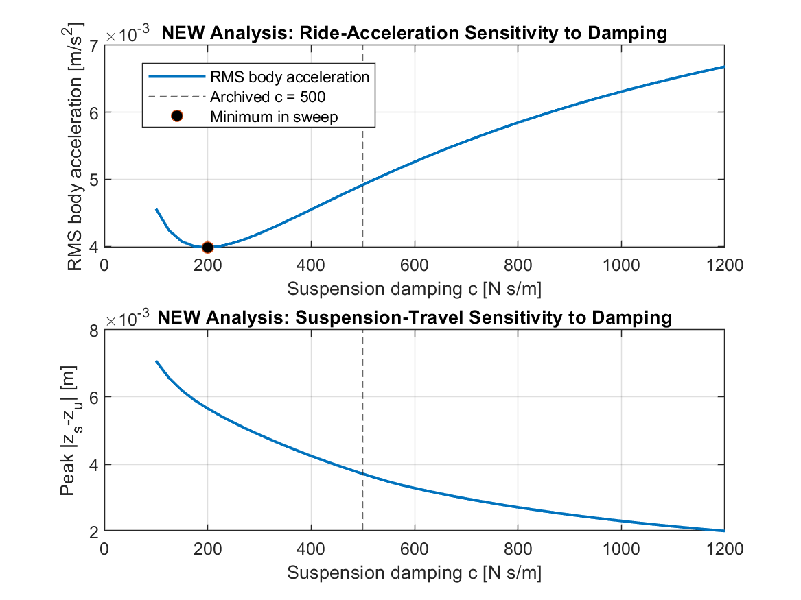

# Quarter-Car Suspension Dynamics & Road-Disturbance Response

A cleaned, reproducible MATLAB project for **passive quarter-car suspension dynamics**, road-disturbance response, modal analysis, frequency response, and damping-sensitivity evaluation.

The public project is built around the archived `suspension.m` state-space model and preserves its:

- sprung and unsprung masses;
- suspension and tire stiffnesses;
- suspension damping;
- four-state model;
- two-input structure;
- zero control-force input;
- two-bump road disturbance.

The cleaned runner extends the original exercise with quantitative diagnostics and clearly labels all added analysis.

> **Scope note:** the archived simulation sets the control-force input identically to zero. This is therefore a **passive suspension** project. It does not claim active or optimal suspension control.

## Quick start

1. Clone or download the repository.
2. Open MATLAB and set the repository as the **Current Folder**.
3. Run:

```matlab
run_quarter_car_suspension_project
```

The script regenerates all results and figures.

**Validated with:** MATLAB R2022b  
**Toolboxes required:** none for the cleaned runner.

## Source-derived model

The state vector is

$$
x =
[z_s,\ \dot z_s,\ z_u,\ \dot z_u]^T,
$$

where:

- \(z_s\): sprung-mass displacement;
- \(z_u\): unsprung-mass displacement.

The archived state-space model uses

$$
\dot x = Ax + Bu,
$$

with

$$
u =
[F_c,\ z_r]^T,
$$

where \(F_c\) is an inter-mass force input and \(z_r\) is road displacement.

For the archived simulation,

$$
F_c = 0.
$$

### Source-derived parameters

| Parameter | Value |
|---|---:|
| Sprung mass \(m\) | 100 kg |
| Unsprung mass \(m_u\) | 10 kg |
| Suspension stiffness \(k_1\) | 200 N/m |
| Tire stiffness \(k_2\) | 200 N/m |
| Suspension damping \(c\) | 500 N·s/m |

These values are preserved from the archived academic model and are not presented as parameters of a production vehicle.

## Passive stability

The nominal state matrix is asymptotically stable.

| Passive pole |
|---:|
| \(-54.25966\) |
| \(-0.434534\) |
| \(-0.152903 + 1.293499j\) |
| \(-0.152903 - 1.293499j\) |

All pole real parts are negative.

## Road disturbance

The archived indexed road input is represented in the cleaned runner by its continuous-time equivalent: two smooth half-sine bumps.

- first bump: **0–20 s**, peak **0.10 m**;
- second bump: **40–60 s**, peak **0.06 m**.



**Figure 1. Source-derived two-bump road disturbance.**

## Passive displacement response



**Figure 2. Road, sprung-mass, and unsprung-mass displacement.**

The body and wheel follow the slow road disturbance closely, with lightly damped oscillatory transients after the bumps.

### Nominal response metrics

| Metric | Value |
|---|---:|
| Maximum road displacement | 0.100000 m |
| Maximum sprung displacement | 0.104203 m |
| Maximum unsprung displacement | 0.102607 m |
| Maximum suspension travel | 0.003715 m |
| Maximum tire deflection | 0.010586 m |
| Maximum \(|\ddot z_s|\) | 0.019354 m/s² |
| RMS body acceleration | 0.004918 m/s² |
| RMS body displacement | 0.037821 m |
| RMS suspension travel | 0.000953 m |
| Peak body/road displacement ratio | 1.0420 |
| Final state norm at 100 s | 2.475e-05 |

## Suspension travel and tire deflection



**Figure 3. Suspension travel and tire deflection relative to the road.**

These relative coordinates are more informative than body displacement alone because they separate suspension stroke from tire/road deformation.

## Vertical acceleration



**Figure 4. Sprung- and unsprung-mass vertical acceleration.**

For the tested slow road profile, the nominal maximum sprung-mass acceleration is approximately **0.0194 m/s²**.

## Phase-plane response



**Figure 5. Sprung-mass displacement–velocity phase plane.**

The trajectory contracts after each road event, consistent with the negative-real-part passive poles.

## Road-to-body frequency response

The cleaned project adds a direct numerical evaluation of

$$
H(j\omega)
=
C(j\omega I-A)^-1B_r
$$

from road displacement to sprung-mass displacement.



**Figure 6. Road-displacement to sprung-displacement frequency response.**

For the source-derived nominal parameters:

| Frequency-response metric | Value |
|---|---:|
| Peak magnitude | 4.6186 |
| Peak magnitude | 13.29 dB |
| Frequency at peak | 0.2036 Hz |

This large low-frequency resonance is a property of the archived academic parameter set and should not be interpreted as a validated production-vehicle suspension characteristic.

## New damping-sensitivity analysis

The original archived model uses

$$
c = 500\\ \text{N·s/m}.
$$

The cleaned project adds a sweep from 100 to 1200 N·s/m to illustrate the competing objectives of ride acceleration and suspension travel.



**Figure 7. New damping-sensitivity analysis.**

For the specific two-bump road profile:

- minimum RMS body acceleration in the tested sweep occurs near **200 N·s/m**;
- that minimum RMS acceleration is **0.003981 m/s²**;
- increasing damping beyond that point continues reducing peak suspension travel, but increases RMS body acceleration.

Therefore, there is **no single universally optimal damping value** in this experiment. The result depends on the chosen performance objective.

The archived \(c=500\) N·s/m value is retained as the nominal case; it is not presented as an optimized value.

## Repository structure

```text
quarter-car-suspension-dynamics/
├── README.md
├── .gitignore
├── run_quarter_car_suspension_project.m
├── docs/
│   └── model_notes.md
├── legacy_source/
│   └── suspension.m
└── results/
    ├── suspension_metrics.csv
    ├── suspension_summary.txt
    ├── state_matrix_A.csv
    ├── input_matrix_B.csv
    ├── passive_poles.csv
    ├── road_to_body_frequency_response.csv
    ├── damping_sensitivity.csv
    └── figures/
        ├── 01_source_road_disturbance.png
        ├── 02_body_and_wheel_displacements.png
        ├── 03_suspension_travel_and_tire_deflection.png
        ├── 04_body_and_wheel_accelerations.png
        ├── 05_sprung_mass_phase_plane.png
        ├── 06_road_to_body_frequency_response.png
        └── 07_damping_sensitivity.png
```

Local runs also generate `.fig` files and `suspension_results.mat`; these binary outputs are excluded from Git by default.

## What was modernized?

The archived `suspension.m` script:

- constructs the state-space matrices;
- defines the road disturbance;
- sets the force input to zero;
- runs `lsim`;
- plots body displacement and disturbance.

The public runner preserves that model but adds:

- direct ODE integration, removing the Control System Toolbox dependency;
- passive pole/stability checks;
- sprung and unsprung state analysis;
- suspension-travel and tire-deflection metrics;
- body-acceleration metrics;
- phase-plane visualization;
- road-to-body frequency response;
- damping-sensitivity analysis.

The added analyses are clearly separated from the source-derived nominal simulation.

## Limitations

- This is a linear 2-DOF quarter-car model.
- The parameters are archived academic values, not experimentally identified vehicle parameters.
- The source-derived stiffness values are much lower than typical real automotive suspension/tire stiffnesses, so the numerical resonance and time scales should be interpreted only within this model.
- Suspension geometry, tire nonlinearity, bump stops, actuator dynamics, aerodynamic effects, and load transfer are not modelled.
- The road disturbance is deterministic and low-frequency.
- The control-force input is zero; no active suspension controller is implemented.
- The damping sweep optimizes no formal multi-objective cost and should not be interpreted as a globally optimal suspension design.
- The other archived optimal-control/genetic-algorithm files from the same coursework folder are intentionally excluded from this repository because they form a separate experiment.

## Background

This repository modernizes a MATLAB state-space exercise on quarter-car suspension response. The public version emphasizes transparent provenance, reproducible simulation, physically interpretable response metrics, and the tradeoff between ride acceleration and suspension travel.

## Author

**Mohammad Hossein Fakouri**  
Robotics, control, vehicle dynamics, and learning-based control  
GitHub: [mhfakouri](https://github.com/mhfakouri)  
Website: [mhfakouri.com](https://mhfakouri.com/)
